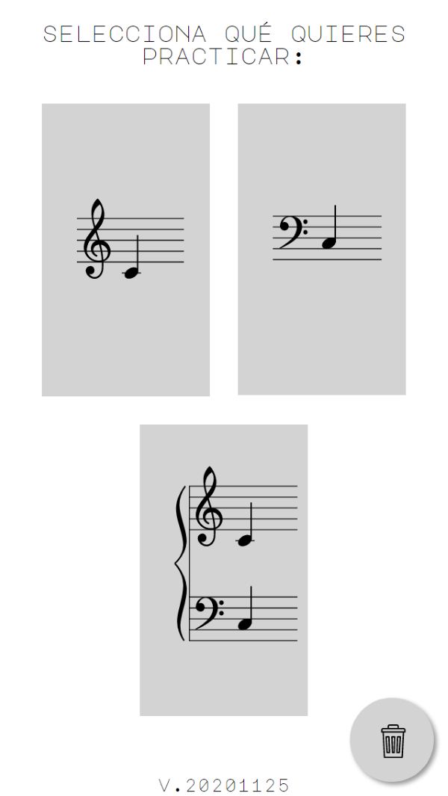
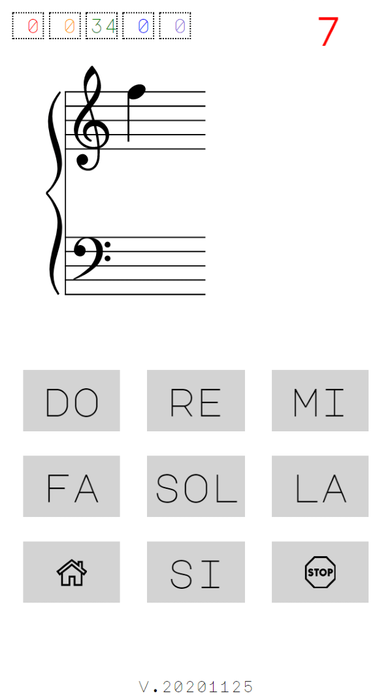
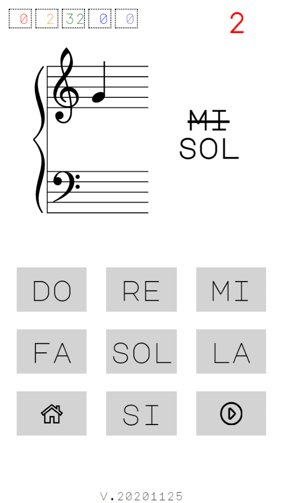

# learn-music-notes
WebApp to practice and acquire mental speed recognizing music notes. It is a responsive PWA HTML, CSS and plain Javascript WebApp.

The webapp presents cards with a musical note and the user has to click the name of the note.

It uses 5 boxes to classify the cards according to how you hit or miss, using the [Leitner System](https://en.wikipedia.org/wiki/Leitner_system).

The webapp is published in https://learn-music-notes.web.app/

## Screenshots

## Credits

Following software and resources has been used:

* [abcjs](https://www.abcjs.net): A Javascript library for rendering abc music notation
* [Major Mono Font](http://www.emreparlak.com/major): A monospaced geometric sans serif all-uppercase typeface
* [Treble clef vector image](https://publicdomainvectors.org/en/free-clipart/Treble-clef-vector-image/8056.html)
